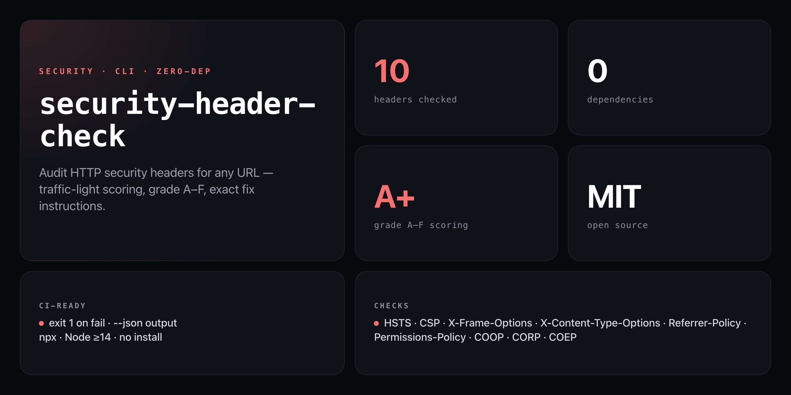

<div align="center">

**Know your security header grade in one command. Fix instructions included.**


</div>

---

Missing a `Content-Security-Policy` lets attackers inject scripts. A weak `Strict-Transport-Security` leaves your HTTPS open to downgrade attacks. Most servers ship with at least three of these headers missing — `security-header-check` tells you exactly which ones, grades the whole picture A through F, and prints the exact header values to paste into your config.

```
🔒 SECURITY HEADER CHECK
━━━━━━━━━━━━━━━━━━━━━━━━━━━━━━━━━━━━━━━━

URL:   https://example.com
Grade: B  Good but gaps remain  (6/10 headers passing)

  ✅ Strict-Transport-Security            max-age=31536000; includeSubDomains
  ✅ X-Content-Type-Options               nosniff
  ✅ X-Frame-Options                      SAMEORIGIN
  ⚠️  Content-Security-Policy             present but permissive (unsafe-inline)
  ❌ Permissions-Policy                   MISSING
  ❌ Referrer-Policy                      MISSING
  ✅ Cross-Origin-Opener-Policy (COOP)    same-origin

Missing headers — add these:
  Permissions-Policy: camera=(), microphone=(), geolocation=(), payment=(), usb=()
  Referrer-Policy: strict-origin-when-cross-origin
```

## Install

No install, no npm account — runs straight from GitHub with zero dependencies:

```bash
npx github:NickCirv/security-header-check https://yoursite.com
```

## Usage

```bash
# Basic check — grades a URL
npx github:NickCirv/security-header-check https://example.com

# Skip https:// — it's assumed
npx github:NickCirv/security-header-check example.com

# JSON output for CI/CD pipelines
npx github:NickCirv/security-header-check https://example.com --json
```

| Flag | Description |
|------|-------------|
| `<url>` | URL to audit (https:// assumed if omitted) |
| `--json` | Machine-readable JSON output |

## Headers checked

| Header | What it protects against |
|--------|--------------------------|
| `Strict-Transport-Security` | HTTPS downgrade attacks |
| `Content-Security-Policy` | XSS, resource injection |
| `X-Content-Type-Options` | MIME sniffing |
| `X-Frame-Options` | Clickjacking |
| `X-XSS-Protection` | Legacy XSS filter (deprecated — checked but not scored) |
| `Referrer-Policy` | Referrer header leakage |
| `Permissions-Policy` | Camera, mic, geolocation access |
| `Cross-Origin-Opener-Policy` | Cross-origin browsing context isolation |
| `Cross-Origin-Resource-Policy` | Cross-origin resource reads |
| `Cross-Origin-Embedder-Policy` | Cross-origin isolation |

## Grade table

| Grade | Threshold | Label |
|-------|-----------|-------|
| **A+** | 10/10 | Fort Knox |
| **A**  | ≥ 85%   | Solid security posture |
| **B**  | ≥ 70%   | Good but gaps remain |
| **C**  | ≥ 50%   | Below average |
| **D**  | ≥ 25%   | Needs serious work |
| **F**  | < 25%   | Wide open. Deploy a WAF immediately. |

Green = 1 pt · Yellow (present but weak) = 0.5 pt · Red (missing) = 0 pt. X-XSS-Protection is excluded from scoring as it is deprecated; CSP replaces it.

## CI/CD integration

Exit code is `0` for A/A+, `1` for anything lower — fails the build when the grade drops:

```yaml
# GitHub Actions
- name: Security header audit
  run: npx github:NickCirv/security-header-check https://yoursite.com --json
```

```json
{
  "url": "https://example.com",
  "grade": "B",
  "label": "Good but gaps remain",
  "score": 6.5,
  "maxScore": 9,
  "headers": [
    {
      "name": "Strict-Transport-Security",
      "key": "strict-transport-security",
      "status": "green",
      "value": "max-age=31536000; includeSubDomains",
      "note": "max-age=31536000; includeSubDomains",
      "recommendation": null
    }
  ]
}
```

## What it is NOT

- **Not a WAF or a prevention tool.** It audits what your server is currently sending — it does not modify headers. Use it to find gaps, then fix them in your server config or CDN.
- **Not a guarantee.** Grading is based on header presence and common best-practice values. A header being present does not mean it is perfectly tuned for your application.
- **Not exhaustive.** It checks the 10 most impactful headers per OWASP guidance. Headers specific to your stack (e.g. `Cache-Control`, `Expect-CT`) are out of scope.

---

<div align="center">
<sub>Zero dependencies · Node 14+ · MIT · by <a href="https://github.com/NickCirv">NickCirv</a></sub>
</div>
